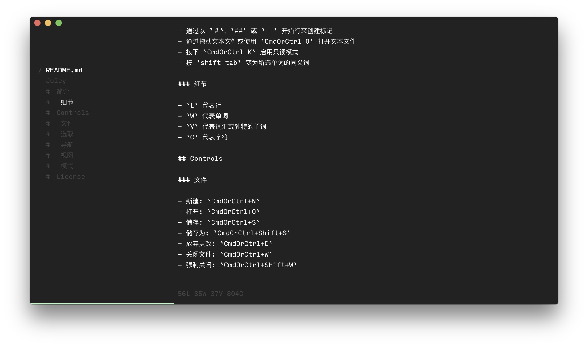

<h1 align="center">Juicy</h1>

## 简介

Juicy 是一个简约，开源和跨平台的 `英文文献翻译工具`

### 下载

* MacOS: [https://github.com/jeasonstudio/Juicy/releases/download/v1.2.0/Juicy-darwin-x64.zip](https://github.com/jeasonstudio/Juicy/releases/download/v1.2.0/Juicy-darwin-x64.zip)
* Windows: [https://github.com/jeasonstudio/Juicy/releases/download/v1.2.0/Juicy-win32-x64.zip](https://github.com/jeasonstudio/Juicy/releases/download/v1.2.0/Juicy-win32-x64.zip)
* Linux: [https://github.com/jeasonstudio/Juicy/releases/download/v1.2.0/Juicy-linux-x64.zip](https://github.com/jeasonstudio/Juicy/releases/download/v1.2.0/Juicy-linux-x64.zip)

- 通过以 `＃`，`##` 或 `--` 开始行来创建标记
- 通过拖动文本文件或使用 `CmdOrCtrl O` 打开文本文件
- 按下 `CmdOrCtrl K` 启用只读模式
- 按 `shift tab` 变为所选单词的同义词

### 细节

- `L` 代表行
- `W` 代表单词
- `V` 代表词汇或独特的单词
- `C` 代表字符

## Controls

### 文件

- 新建: `CmdOrCtrl+N`
- 打开: `CmdOrCtrl+O`
- 储存: `CmdOrCtrl+S`
- 储存为: `CmdOrCtrl+Shift+S`
- 放弃更改: `CmdOrCtrl+D`
- 关闭文件: `CmdOrCtrl+W`
- 强制关闭: `CmdOrCtrl+Shift+W`

### 选取

- 同义词: `Shift+Tab`
- 选中翻译: `CmdOrCtrl+T`
- 选中复原: `CmdOrCtrl+Y`

### 导航

- 下一处标记: `CmdOrCtrl+]`
- 上一处标记: `CmdOrCtrl+[`
- 下一个文件: `CmdOrCtrl+Shift+]`
- 上一个文件: `CmdOrCtrl+Shift+[`

### 视图
- 放大: `CmdOrCtrl+Plus`
- 缩小: `CmdOrCtrl+-`
- 还原: `CmdOrCtrl+0`

### 模式
- 只读模式: `CmdOrCtrl+K`
- 网页读取: `CmdOrCtrl+F`

## License

See the [License](LICENSE.md) file for license rights and limitations (MIT).
